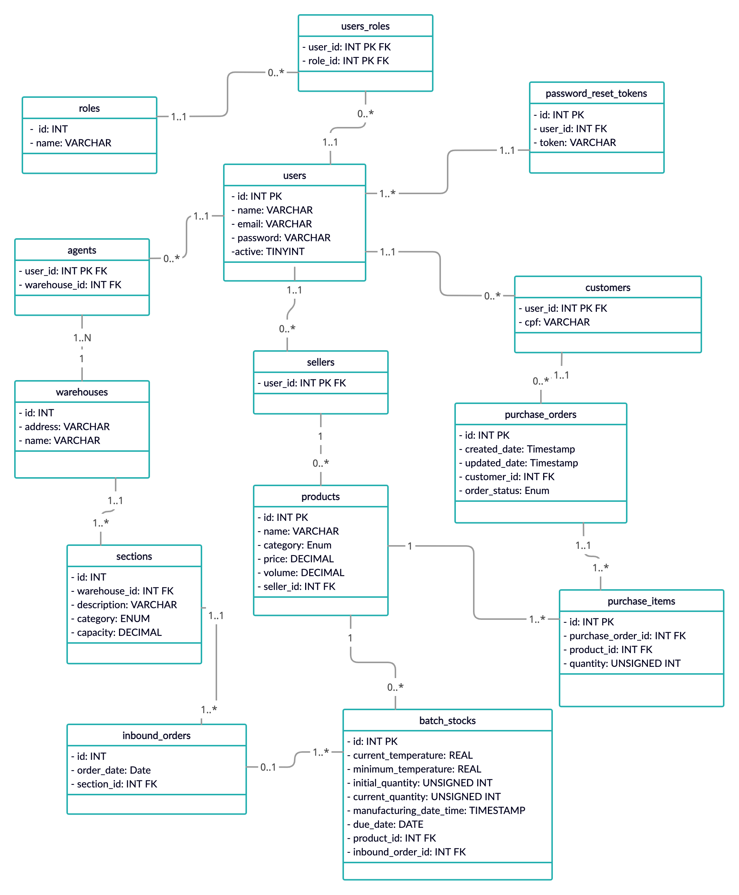

## IT BOOTCAMP - Grupo 1

## Projeto Integrador

### Objetivo
O objetivo deste projeto final é implementar uma API REST no âmbito do slogan e aplicar
os conteúdos trabalhados durante o BOOTCAMP MELI. (Git, Java, Spring, Banco de Dados,
Qualidade e Segurança).

### Enunciado

O Mercado Livre é a empresa líder em comércio eletrônico da LATAM, com operações
em 18 países. A MELI (como é conhecida por sua sigla na Bolsa de Valores de NY) quer
expandir seus negócios para incluir em sua listagem (oferta) produtos FRESCOS. Hoje a MELI
já vende produtos alimentícios, mas quer se aventurar a poder vender produtos que precisam
de refrigeração; chamados produtos frescos. Implica novos desafios na forma de armazenar,
transportar e comercializar os produtos, uma vez que é feito de uma forma totalmente
diferente. O modelo de negócio atualmente implementado em relação à forma como
tratamos os nossos produtos (armazenamento, transporte e comercialização) é incompatível
com os produtos frescos da indústria alimentar, portanto temos o desafio de cumprir estes
novos requisitos de forma a atender às necessidades deste novo mercado.

[Ver mais...](https://drive.google.com/file/d/1bBOM49bxqRR7apxP3sgV7_LRiTq9xQD2/view)

### Rodar Aplicacao

Para rodar a aplicação execute o comando no diretorio do projeto:
```
mvn spring-boot:run
```

### Documentacao
A API está documentada no Swagger, com a aplicação rodando acesse o endpoint:
```
http://localhost:8080/swagger-ui/
```

### Postman

[Link do Postman](PI%20-%20Meli%20Frescos.postman_collection.json)

### Diagrama de Entidade Relacionamento (DER)



### Requisitos

[X] [Requisito 01](https://drive.google.com/file/d/1rbT3upYAwN-CrOVtze0M2Fq7Cobuj7FD/view)

[X] [Requisito 02](https://drive.google.com/file/d/1M66St3F6TwWJ6WG_s1in75_bMyeKb8PM/view)

[X] [Requisito 03](https://drive.google.com/file/d/1GnTl6sHhdvyKjR0oz0nXlyvzH-oW_2Jv/view)

[X] [Requisito 04](https://drive.google.com/file/d/1kNZLztafr2tXuDU24W9xwUu09va2kMP0/view)

[X] [Requisito 05](https://drive.google.com/file/d/1yiEzdwI87K7AO9bgPffHbb0DPjVKM-oP/view)

[X] [Requisito 06](https://docs.google.com/document/d/1nTXKR2jyBP3pvsc_Xc1koTL61NVqABJ9W_JwI-OTGug/edit?usp=sharing)

### Ferramentas e Tecnologias
- [Java](https://docs.oracle.com/en/java/)
- [SpringBoot](https://spring.io/projects/spring-boot)
- [Maven](https://maven.apache.org/guides/)
- [HTTP](https://devdocs.io/http/)
- [Mockito](https://site.mockito.org/)
- [H2 DataBase](https://www.h2database.com/html/main.html)
- [MySQL](https://dev.mysql.com/doc/)
- [JUnit](https://junit.org/junit5/docs/5.0.0/api/overview-summary.html)
- [JWT](https://jwt.io/introduction)
- [JPA](https://docs.spring.io/spring-data/jpa/docs/current/reference/html/)
- [Swagger](https://swagger.io/)

### Integrantes:
- [Ederson Araújo](https://github.com/edersonrodara)
- [Gabriel Essênio](https://github.com/GabrielEssenio)
- [Jefferson Botelho](https://github.com/jeffbotelho)
- [Nayara Coca](https://github.com/Naycoca)
- [Rogério Lambert](https://github.com/rogerio-lambert)
- [Weverton Bruno](https://github.com/wevertonbruno)